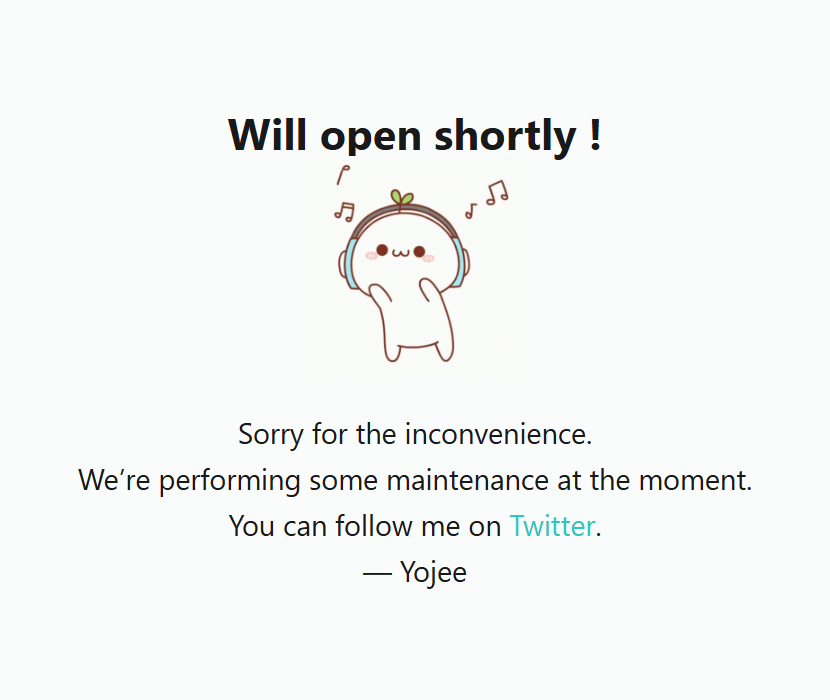

### [404-cute](https://yojeero.github.io/404-cute/) - site maintenance HTML template

- Clean design
- Fully responsive layout
- Grid CSS

- copy 404.html in root directory (all styles inside 404.html)
- copy 404.png or any yours image to img folder and rename image to 404.png
- rename index.html
