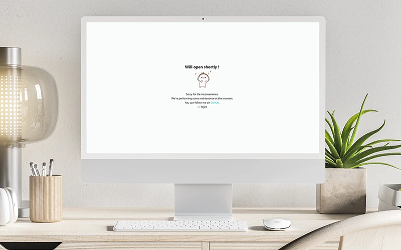

   

### [404-cute](https://yojeero.github.io/404-cute/) - maintenance website   

##### 100% responsive   

1. Copy 404.html in root directory (all styles inside 404.html)
2. Copy 404.png or any yours image to img folder and rename image to 404.png
3. Rename index.html

##### Tech Stack   
```
HTML5 | CSS3 | Vercel | for 404   
```
